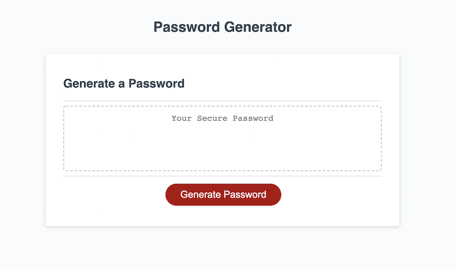

# Password Generator

## Objective
Create an app that allows users to select the parameters of what they would like to include in a password. Using Javascript, generate a randomized password based on the included paramters. 

## Technologies Used
HTML 
CSS
Javascript

## Links
* Deployed Site: https://evapopp.github.io/generator/
* Repo: https://github.com/evapopp/generator

## Page Preview
